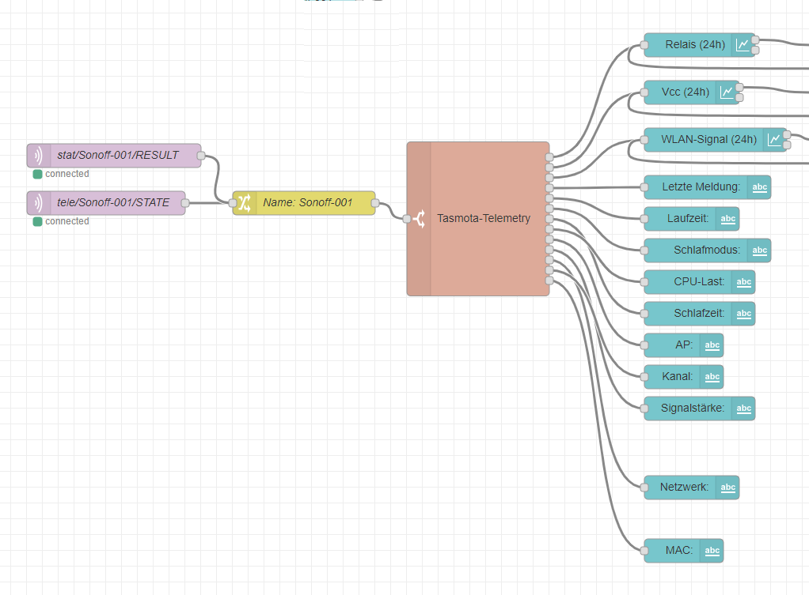
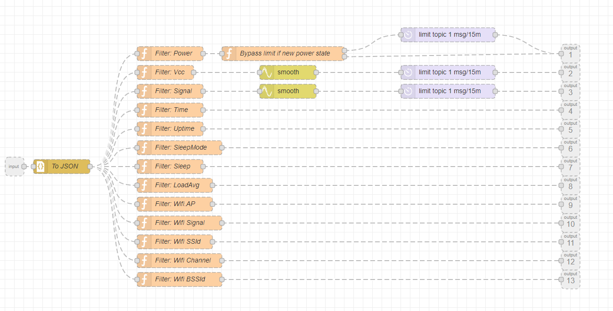

# node-red-sonoff-mqtt-telemetry-reader

This node-red flow example allows processing telemetry data from a tasmota device.

The idea is to process telemetry, and create easy dashboards for devices, and also track their performance values on graphs for statistics.

This is just an on-the-fly made parser.
But as I did not find an already working solution for this, I just felt like sharing it here.
Always open for improvement.

I added this in three versions:

- The file "subflow-bare" contains a node-red export of the subflow to form the telemetry device internals.
- "subflow-as-module" is an export of the whole converter, to paste directly into your current node-red-flow.
- "flow-example" contains the whole example flow from the screenshots below.

Example usage:

Subflow preview:

UI-Example view:

